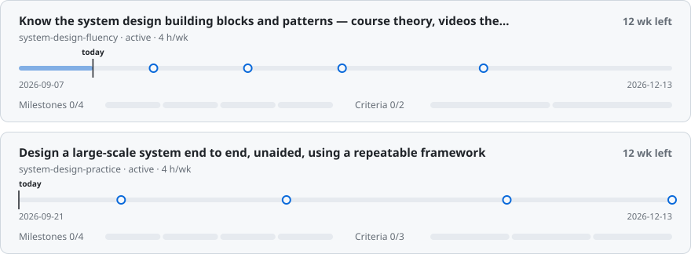
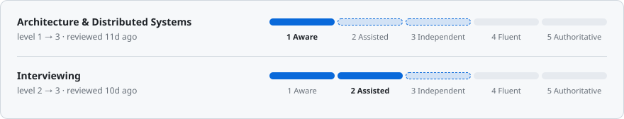
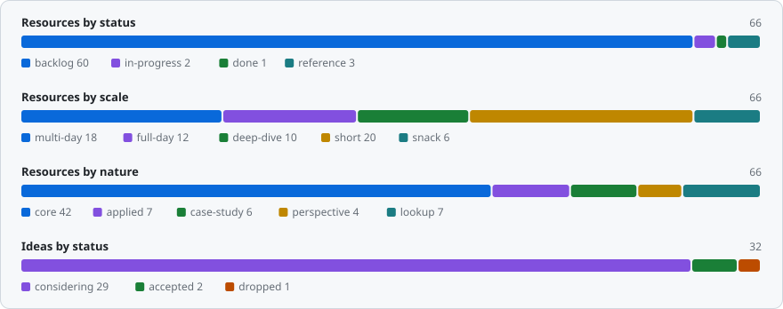

<!-- Generated by system/scripts/dashboard.mjs. Do not edit by hand — edit the entity files and
     rerun `node system/scripts/dashboard.mjs`. The Markdown entities are the source of truth. -->

<h1 align="center">AI_SKILL_ASSISTANT</h1>

Software-engineering skill growth — goals, resources, weekly plans. 
<code>2026-09-19</code> · <code>W38(14-20.09)</code> · <a href="docs/guide.md">Guide</a> · <a href="CLAUDE.md">Conventions</a>

<picture>
  <source media="(prefers-color-scheme: dark)" srcset="system/assets/dashboard/kpi-dark.svg">
  
</picture>

> [!WARNING]
> **6 untriaged ideas** — `kb/ideas/`. Run `/groom` — inbox items are invisible to planning.

## 🎯 Goals

<picture>
  <source media="(prefers-color-scheme: dark)" srcset="system/assets/dashboard/goals-dark.svg">
  
</picture>

[system-design-fluency](kb/goals/system-design-fluency.md) · [system-design-practice](kb/goals/system-design-practice.md)

### Next milestones

| Due          | In  | Goal                                                         | Milestone                                                                                                              |
|--------------|-----|--------------------------------------------------------------|------------------------------------------------------------------------------------------------------------------------|
| `2026-09-27` | 8d  | [system-design-fluency](kb/goals/system-design-fluency.md)   | Videos: Part 1 — 02 Foundations, 03 Thinking in Scale (~2.5h left)                                                     |
| `2026-10-04` | 15d | [system-design-practice](kb/goals/system-design-practice.md) | Bitly, News Aggregator, Ad Click Aggregator, FB Live Comments, WhatsApp (~6.5h)                                        |
| `2026-10-11` | 22d | [system-design-fluency](kb/goals/system-design-fluency.md)   | Videos: Part 2 — Scaling Reads, Redis, Scaling Writes, Kafka, Cassandra, Real-time Updates, Multi-step Processes (~7h) |
| `2026-10-25` | 36d | [system-design-fluency](kb/goals/system-design-fluency.md)   | Texts: Part 1 — 02, 03 guides, Numbers to Know (~4h; 01 done)                                                          |
| `2026-10-25` | 36d | [system-design-practice](kb/goals/system-design-practice.md) | Ticketmaster, Online Auction, Notification System, Payment System, Dropbox, YouTube (~6.5h)                            |

## 🗓️ This week — `W38(14-20.09)`

1/3 done · 3h committed of `8h` · [2026-W38](kb/planning/2026/2026-W38.md)

- [x] (1h) — [hello-interview-system-design-course](kb/resources/architecture/system-design/hello-interview-system-design-course.md): 02 Indexing video + quiz — closes 02 Foundations (pass 1)
- [ ] (2h) — [hello-interview-system-design-course](kb/resources/architecture/system-design/hello-interview-system-design-course.md): 03 Caching, Sharding, Consistent Hashing videos — Caching done 2026-09-18
- [ ] (20m) — [hello-interview-mastering-estimation](kb/resources/architecture/system-design/hello-interview-mastering-estimation.md) + [hello-interview-numbers-to-know](kb/resources/architecture/system-design/hello-interview-numbers-to-know.md), added 2026-09-17 — 03 covers Numbers to Know

## 📖 In flight

| Resource                                                                                                                | Kind   | Progress                                                                                       | Effort | Priority | Updated |
|-------------------------------------------------------------------------------------------------------------------------|--------|------------------------------------------------------------------------------------------------|--------|----------|---------|
| [hello-interview-system-design-course](kb/resources/architecture/system-design/hello-interview-system-design-course.md) | course | Videos: 02 done, 03: Caching done 2026-09-18 — Sharding next · Texts: 01 done · Practice: none | 31h    | high     | today   |

## 📈 Areas

<picture>
  <source media="(prefers-color-scheme: dark)" srcset="system/assets/dashboard/areas-dark.svg">
  
</picture>

[architecture](kb/areas/architecture.md) · [interviewing](kb/areas/interviewing.md)

<b>⏱️ Pick by time</b> — 23 backlog resources that fit a gap

| Resource                                                                                                                | Scale | Effort | Nature      | Priority |
|-------------------------------------------------------------------------------------------------------------------------|-------|--------|-------------|----------|
| [fowler-evolutionary-database-design](kb/resources/data/fowler-evolutionary-database-design.md)                         | short | 30m    | core        | high     |
| [hello-interview-mastering-estimation](kb/resources/architecture/system-design/hello-interview-mastering-estimation.md) | snack | 10m    | core        | high     |
| [functional-core-imperative-shell](kb/resources/architecture/clean-architecture/functional-core-imperative-shell.md)    | short | 30m    | core        | medium   |
| [distributed-snapshots-paper](kb/resources/architecture/distributed-systems/distributed-snapshots-paper.md)             | short | 45m    | core        | medium   |
| [google-cloud-spanner-talk](kb/resources/architecture/distributed-systems/google-cloud-spanner-talk.md)                 | short | 45m    | case-study  | medium   |
| [why-pick-strong-consistency](kb/resources/architecture/distributed-systems/why-pick-strong-consistency.md)             | short | 20m    | core        | medium   |
| [calculus-of-service-availability](kb/resources/architecture/resilience/calculus-of-service-availability.md)            | short | 45m    | core        | medium   |
| [service-mesh-survey](kb/resources/architecture/service-mesh/service-mesh-survey.md)                                    | short | 25m    | case-study  | medium   |
| [discord-trillions-of-messages](kb/resources/architecture/system-design/discord-trillions-of-messages.md)               | short | 25m    | case-study  | medium   |
| [netflix-system-design](kb/resources/architecture/system-design/netflix-system-design.md)                               | short | 30m    | case-study  | medium   |
| [inverse-conway-maneuver](kb/resources/career/inverse-conway-maneuver.md)                                               | short | 20m    | core        | medium   |
| [allegro-db-maintenance-3tb-to-100gb](kb/resources/data/allegro-db-maintenance-3tb-to-100gb.md)                         | short | 20m    | case-study  | medium   |
| [allegro-transactions-in-mongodb](kb/resources/data/allegro-transactions-in-mongodb.md)                                 | short | 20m    | core        | medium   |
| [feature-flags-primer](kb/resources/devops/feature-flags-primer.md)                                                     | short | 30m    | core        | medium   |
| [kotlin-programming-with-result](kb/resources/languages/kotlin-programming-with-result.md)                              | short | 20m    | applied     | medium   |
| [joel-things-you-should-never-do](kb/resources/quality/joel-things-you-should-never-do.md)                              | short | 20m    | perspective | medium   |
| [fowler-tolerant-reader](kb/resources/backend/fowler-tolerant-reader.md)                                                | snack | 10m    | core        | medium   |
| [mocking-is-a-code-smell](kb/resources/quality/mocking-is-a-code-smell.md)                                              | snack | 15m    | perspective | medium   |
| [google-monorepo-billions-of-lines](kb/resources/architecture/system-design/google-monorepo-billions-of-lines.md)       | short | 25m    | case-study  | low      |
| [jol-java-object-layout-plugin](kb/resources/languages/jol-java-object-layout-plugin.md)                                | short | 20m    | lookup      | low      |
| [tests-execution-chart](kb/resources/quality/tests-execution-chart.md)                                                  | short | 30m    | lookup      | low      |
| [boolean-blindness](kb/resources/architecture/design-patterns/boolean-blindness.md)                                     | snack | 15m    | perspective | low      |
| [fowler-value-object](kb/resources/architecture/design-patterns/fowler-value-object.md)                                 | snack | 10m    | core        | low      |

<b>📚 Library</b> — 63 resources, 32 ideas, 3 goals, 2 areas, 4 plans

<picture>
  <source media="(prefers-color-scheme: dark)" srcset="system/assets/dashboard/shape-dark.svg">
  
</picture>

| Entity    | Count | By status                                         |
|-----------|-------|---------------------------------------------------|
| Ideas     | 32    | inbox 6 · considering 24 · accepted 1 · dropped 1 |
| Resources | 63    | backlog 58 · in-progress 1 · done 1 · reference 3 |
| Goals     | 3     | active 2 · on-hold 1                              |
| Areas     | 2     | —                                                 |
| Plans     | 4     | —                                                 |

---

Generated by <code>node system/scripts/dashboard.mjs</code> from the Markdown entities. How it works: <a href="docs/guide.md">docs/guide.md</a>.
