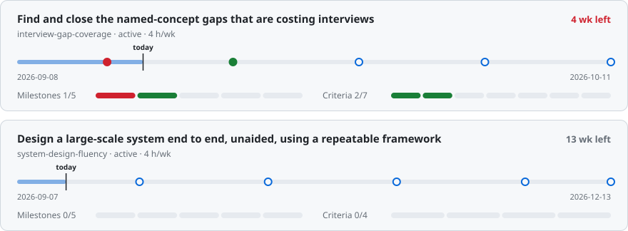
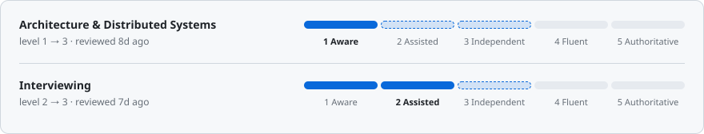
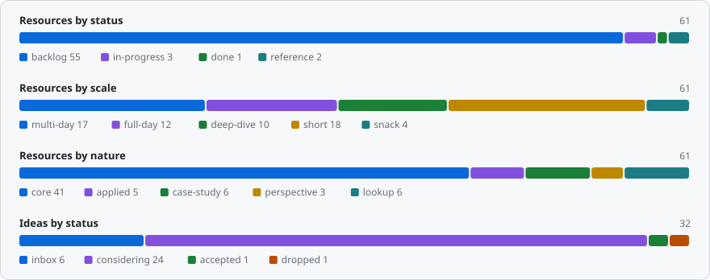

<!-- Generated by scripts/dashboard.mjs. Do not edit by hand — edit the entity files and
     rerun `node scripts/dashboard.mjs`. The Markdown entities are the source of truth. -->

<h1 align="center">AI_SKILL_ASSISTANT</h1>

Software-engineering skill growth — goals, resources, weekly plans. 
<code>2026-09-15</code> · <code>W38(14-20.09)</code> · <a href="docs/guide.md">Guide</a> · <a href="CLAUDE.md">Conventions</a>

<picture>
  <source media="(prefers-color-scheme: dark)" srcset="assets/dashboard/kpi-dark.svg">
  
</picture>

> [!WARNING]
> **Milestone slipped `2026-09-13`** — [interview-gap-coverage](goals/interview-gap-coverage.md). Ledger created; recall pass over past interviews; Outbox and the browser boundary written up as the two worked examples (~3h) — **slipped**: ledger done, recall pass and rewrites not started.

## ⚠️ Also needs attention

| What              | Where    | Why it matters                                       |
|-------------------|----------|------------------------------------------------------|
| 6 untriaged ideas | `ideas/` | Run `/groom` — inbox items are invisible to planning |

## 🎯 Goals

<picture>
  <source media="(prefers-color-scheme: dark)" srcset="assets/dashboard/goals-dark.svg">
  
</picture>

[interview-gap-coverage](goals/interview-gap-coverage.md) · [system-design-fluency](goals/system-design-fluency.md)

### Next milestones

| Due          | In         | Goal                                                      | Milestone                                                                                                                                                                                                                                       |
|--------------|------------|-----------------------------------------------------------|-------------------------------------------------------------------------------------------------------------------------------------------------------------------------------------------------------------------------------------------------|
| `2026-09-13` | 🔴 2d late | [interview-gap-coverage](goals/interview-gap-coverage.md) | Ledger created; recall pass over past interviews; Outbox and the browser boundary written up as the two worked examples (~3h) — **slipped**: ledger done, recall pass and rewrites not started                                                  |
| `2026-09-27` | 12d        | [interview-gap-coverage](goals/interview-gap-coverage.md) | Messaging sweep 2: [enterprise-integration-patterns](resources/architecture/integration-patterns/enterprise-integration-patterns.md) headings marked; all unknowns from both sweeps written up (~4h) — marked 2026-09-09, write-ups outstanding |
| `2026-09-27` | 12d        | [system-design-fluency](goals/system-design-fluency.md)   | Part 1: Orientation, Foundations, Thinking in Scale (~8h)                                                                                                                                                                                       |
| `2026-10-04` | 19d        | [interview-gap-coverage](goals/interview-gap-coverage.md) | Runtime boundary sweep: browser, JVM process, container, serverless; findings written up (~4h) — marked 2026-09-09, write-ups outstanding                                                                                                       |
| `2026-10-11` | 26d        | [interview-gap-coverage](goals/interview-gap-coverage.md) | Cold re-test on everything written before 2026-09-27; [interviewing](areas/interviewing.md) re-assessed; next two sweeps chosen (~3h)                                                                                                           |

## 🗓️ This week — `W38(14-20.09)`

0/5 done · 6h committed of `8h` · [2026-W38](planning/2026/2026-W38.md)

- [ ] (1h) — [interview-gap-coverage](goals/interview-gap-coverage.md): Outbox + browser-cannot-listen rewritten in [interviewing](areas/interviewing.md) from memory, each timed — carried from W37(07-13.09)
- [ ] (1h) — [interview-gap-coverage](goals/interview-gap-coverage.md): recall pass over past interviews into the [interviewing](areas/interviewing.md) ledger — carried from W37(07-13.09)
- [ ] (1h) — [interview-gap-coverage](goals/interview-gap-coverage.md): first `none`/`minimal` write-ups from the 87-term queue, timed; re-size the goal's capacity check from the measured rate
- [ ] (1h) — [hello-interview-system-design-course](resources/architecture/system-design/hello-interview-system-design-course.md): 02 Indexing + quiz — closes 02 Foundations
- [ ] (2h) — [hello-interview-system-design-course](resources/architecture/system-design/hello-interview-system-design-course.md): 03 Caching, Sharding, Consistent Hashing

## 📖 In flight

| Resource                                                                                                             | Kind   | Progress                                                                | Effort | Priority | Updated |
|----------------------------------------------------------------------------------------------------------------------|--------|-------------------------------------------------------------------------|--------|----------|---------|
| [designing-event-driven-systems](resources/architecture/event-driven/designing-event-driven-systems.md)              | book   | first pass done, second pass pending                                    | 10h    | high     | 8d ago  |
| [building-microservices](resources/architecture/microservices/building-microservices.md)                             | book   | first pass done, second pass pending                                    | 20h    | high     | 8d ago  |
| [hello-interview-system-design-course](resources/architecture/system-design/hello-interview-system-design-course.md) | course | 01 done; 02: Networking, API Design, Data Modeling done — Indexing next | 31h    | high     | today   |

## 📈 Areas

<picture>
  <source media="(prefers-color-scheme: dark)" srcset="assets/dashboard/areas-dark.svg">
  
</picture>

[architecture](areas/architecture.md) · [interviewing](areas/interviewing.md)

<b>⏱️ Pick by time</b> — 22 backlog resources that fit a gap

| Resource                                                                                                          | Scale | Effort | Nature      | Priority |
|-------------------------------------------------------------------------------------------------------------------|-------|--------|-------------|----------|
| [fowler-evolutionary-database-design](resources/data/fowler-evolutionary-database-design.md)                      | short | 30m    | core        | high     |
| [functional-core-imperative-shell](resources/architecture/clean-architecture/functional-core-imperative-shell.md) | short | 30m    | core        | medium   |
| [distributed-snapshots-paper](resources/architecture/distributed-systems/distributed-snapshots-paper.md)          | short | 45m    | core        | medium   |
| [google-cloud-spanner-talk](resources/architecture/distributed-systems/google-cloud-spanner-talk.md)              | short | 45m    | case-study  | medium   |
| [why-pick-strong-consistency](resources/architecture/distributed-systems/why-pick-strong-consistency.md)          | short | 20m    | core        | medium   |
| [calculus-of-service-availability](resources/architecture/resilience/calculus-of-service-availability.md)         | short | 45m    | core        | medium   |
| [service-mesh-survey](resources/architecture/service-mesh/service-mesh-survey.md)                                 | short | 25m    | case-study  | medium   |
| [discord-trillions-of-messages](resources/architecture/system-design/discord-trillions-of-messages.md)            | short | 25m    | case-study  | medium   |
| [netflix-system-design](resources/architecture/system-design/netflix-system-design.md)                            | short | 30m    | case-study  | medium   |
| [inverse-conway-maneuver](resources/career/inverse-conway-maneuver.md)                                            | short | 20m    | core        | medium   |
| [allegro-db-maintenance-3tb-to-100gb](resources/data/allegro-db-maintenance-3tb-to-100gb.md)                      | short | 20m    | case-study  | medium   |
| [allegro-transactions-in-mongodb](resources/data/allegro-transactions-in-mongodb.md)                              | short | 20m    | core        | medium   |
| [feature-flags-primer](resources/devops/feature-flags-primer.md)                                                  | short | 30m    | core        | medium   |
| [kotlin-programming-with-result](resources/languages/kotlin-programming-with-result.md)                           | short | 20m    | applied     | medium   |
| [joel-things-you-should-never-do](resources/quality/joel-things-you-should-never-do.md)                           | short | 20m    | perspective | medium   |
| [fowler-tolerant-reader](resources/backend/fowler-tolerant-reader.md)                                             | snack | 10m    | core        | medium   |
| [mocking-is-a-code-smell](resources/quality/mocking-is-a-code-smell.md)                                           | snack | 15m    | perspective | medium   |
| [google-monorepo-billions-of-lines](resources/architecture/system-design/google-monorepo-billions-of-lines.md)    | short | 25m    | case-study  | low      |
| [jol-java-object-layout-plugin](resources/languages/jol-java-object-layout-plugin.md)                             | short | 20m    | lookup      | low      |
| [tests-execution-chart](resources/quality/tests-execution-chart.md)                                               | short | 30m    | lookup      | low      |
| [boolean-blindness](resources/architecture/design-patterns/boolean-blindness.md)                                  | snack | 15m    | perspective | low      |
| [fowler-value-object](resources/architecture/design-patterns/fowler-value-object.md)                              | snack | 10m    | core        | low      |

<b>📚 Library</b> — 61 resources, 32 ideas, 2 goals, 2 areas, 4 plans

<picture>
  <source media="(prefers-color-scheme: dark)" srcset="assets/dashboard/shape-dark.svg">
  
</picture>

| Entity    | Count | By status                                         |
|-----------|-------|---------------------------------------------------|
| Ideas     | 32    | inbox 6 · considering 24 · accepted 1 · dropped 1 |
| Resources | 61    | backlog 55 · in-progress 3 · done 1 · reference 2 |
| Goals     | 2     | active 2                                          |
| Areas     | 2     | —                                                 |
| Plans     | 4     | —                                                 |

---

Generated by <code>node scripts/dashboard.mjs</code> from the Markdown entities. How it works: <a href="docs/guide.md">docs/guide.md</a>.
